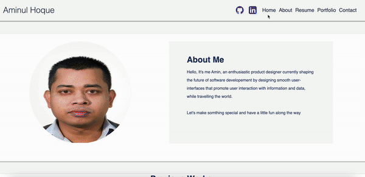

# Portfolio
I've created a portfolio website based on information given to me on week 7nd assignment, i've modified the protfolio
(in assignment)..I've tried my best to make it more prettier.

# Updated:
Github profile
Linkedin profile
Pinned projects : 
- Project 1 : Flavourful : a recipe finder App
- Password generator
- JS Quiz App
- MIT license
Projects with the repository links.

this portfolio is displaying an "About Me", "Experience", "Contact section", with links navigating to each section. 

In addition to displaying and properly linking homeworks with functioning image links. The purpose of the assignment was to ensure that we created a portfolio that reflected the coder as an individual, their past works, some information about them, and how to conatact.

# User Story

AS AN employer. I WANT to view a potential employee's deployed portfolio of work samples. SO THAT I can review samples of their work and assess whether they're a good candidate for an open position

## Homework Requirements

* Updated portfolio featuring Project 1 and two exemplary homework assignments.

* Updated GitHub profile with pinned repositories featuring Project 1 and two exemplary assignments.

* Updated resume

* Updated LinkedIn profile

## Grading

| Requirement      | Weight |
| ---------------- | ------ |
| Portfolio        | 40%    |
| GitHub Profile   | 40%    |
| Resume           | 10%    |
| LinkedIn Profile | 10%    |

# Screenshot

# Link
link of the Github directory : https://github.com/ausamindec/week-8_updated-portfolio.git

# Link of Hosted Website
link : https://ausamindec.github.io/week-8_updated-portfolio/
